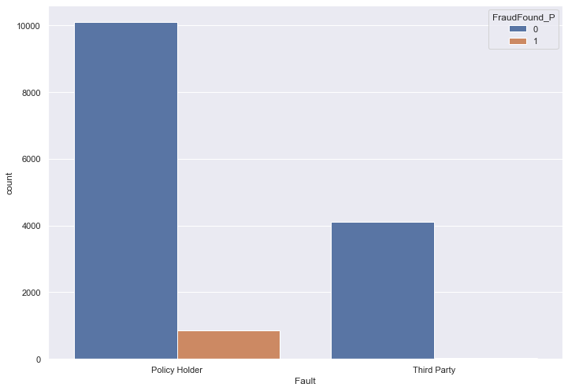
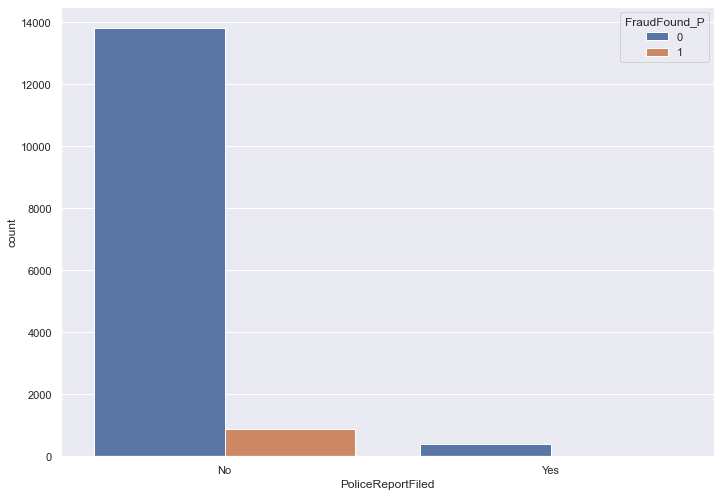
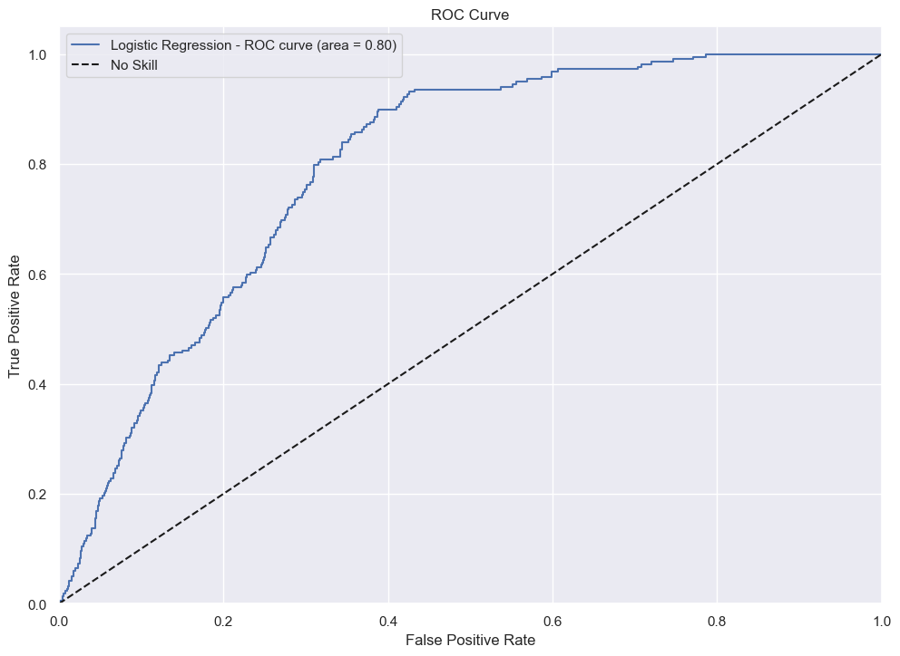
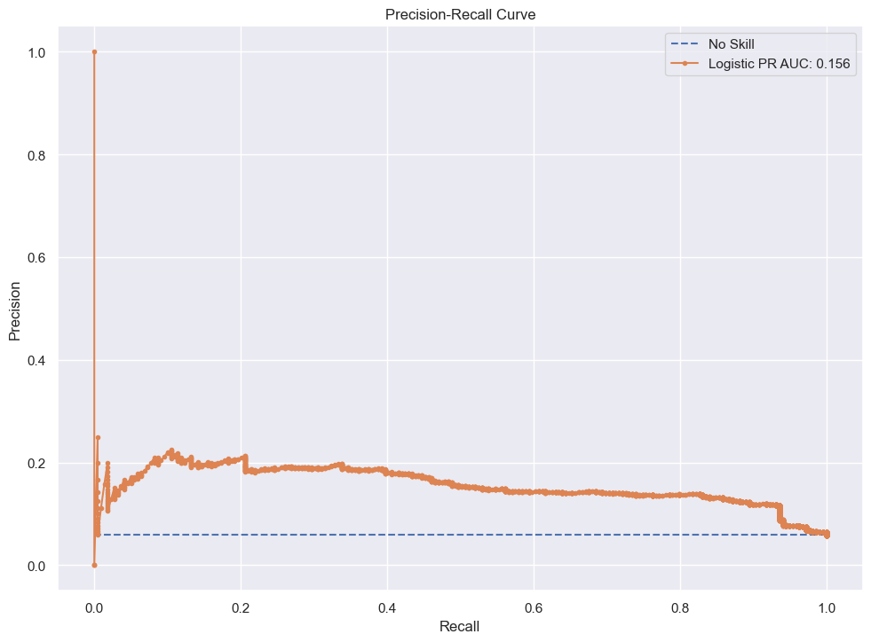
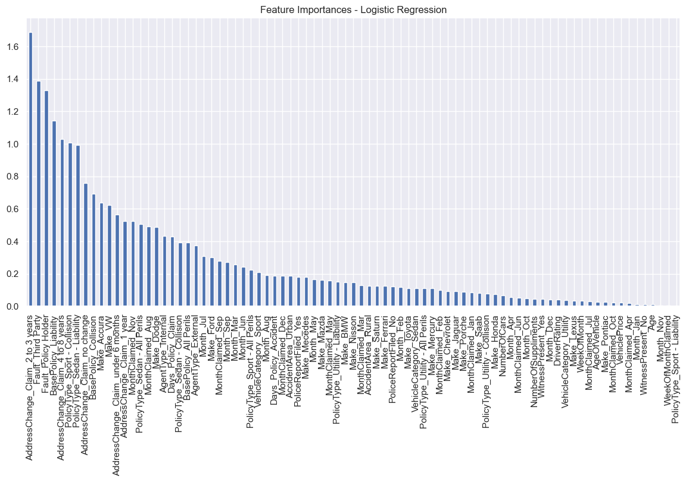
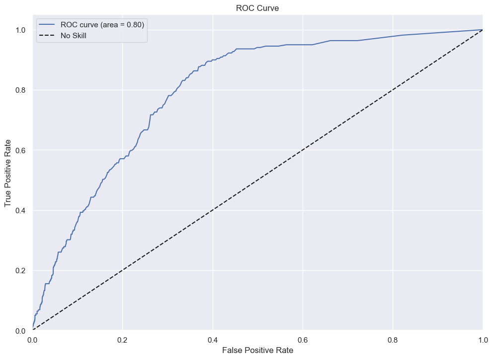
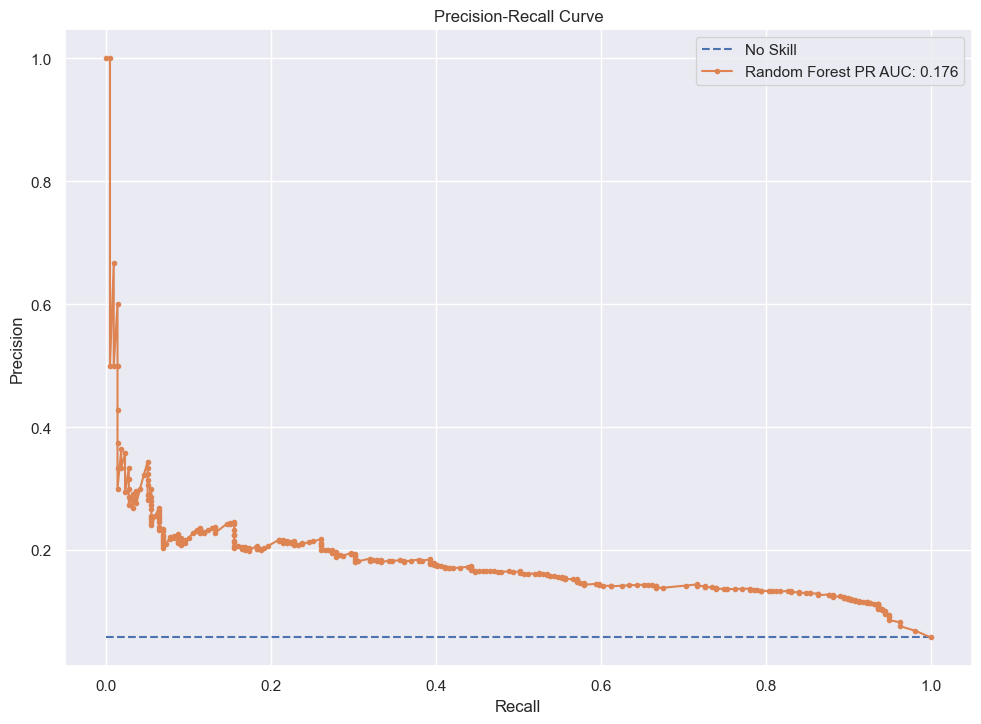
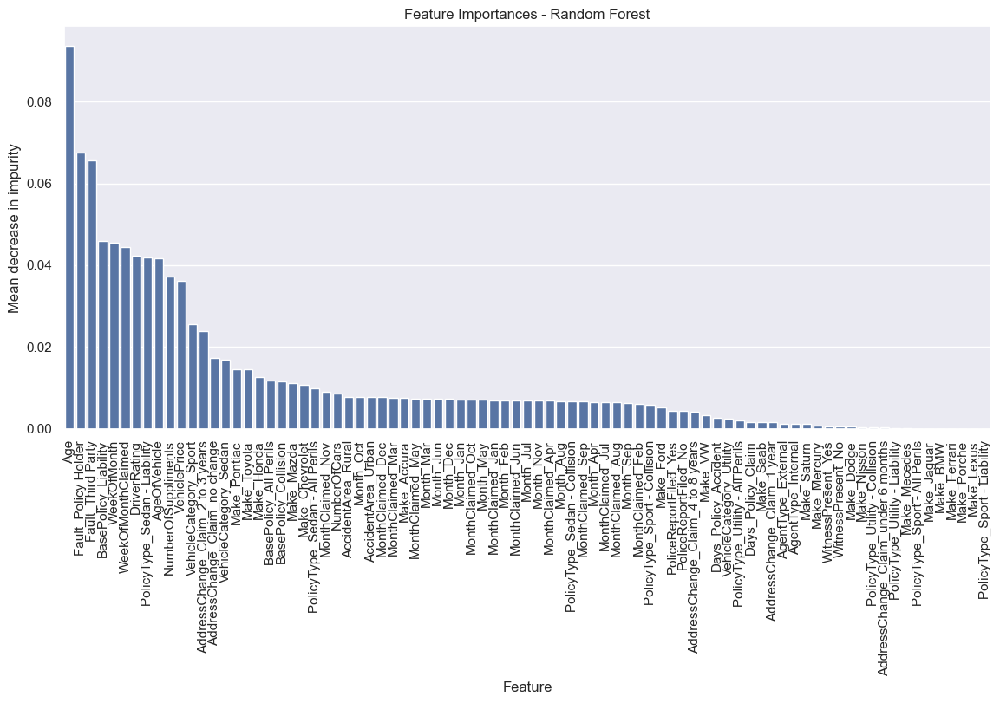
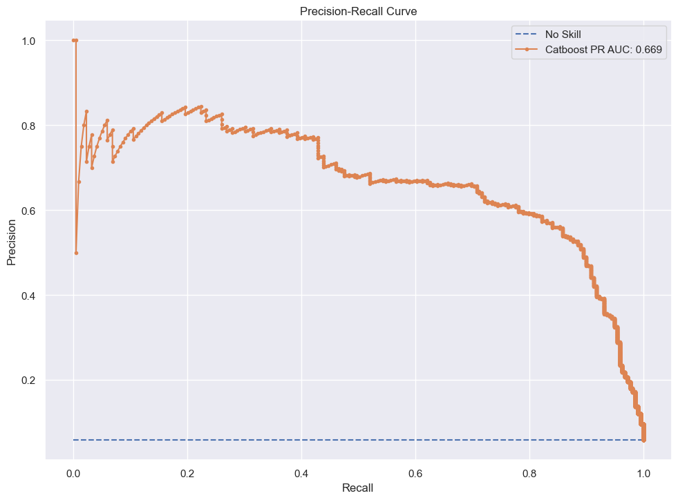

# Fraud Detection of Auto Insurance Claims

## Introduction and Exploratory Data Analysis
This analysis explores trends in car insurance claim fraud. A machine learning model was created in order to predict new claims as being fraudulent or not. The dataset consists of 15420 claims from the Jan. 1994 to Dec. 1996, with various features about the claim, including date and location of incidence, driver information, car information, policy information etc. There is also a column "FraudFound_P" which indicates whether or not the claim was fraudulent. 

To begin, exploratory data analysis was performed to identify relationships in the data and to ascertain correlations between features and the incidence of fraud. Three relationships in particular demonstrated a clear relationship:

## Data Cleansing

Next, data cleansing was performed to prepare the data for modeling. In order to run the logistic regression and random forest models, categorical data needed to be converted to numerical data. This was achieved using the scikit-learn preprocessing modules OneHotEncoder and OrdinalEncoder. 

## Modeling

Logistic Regression

Random Forest

CatBoost

XGBBoost