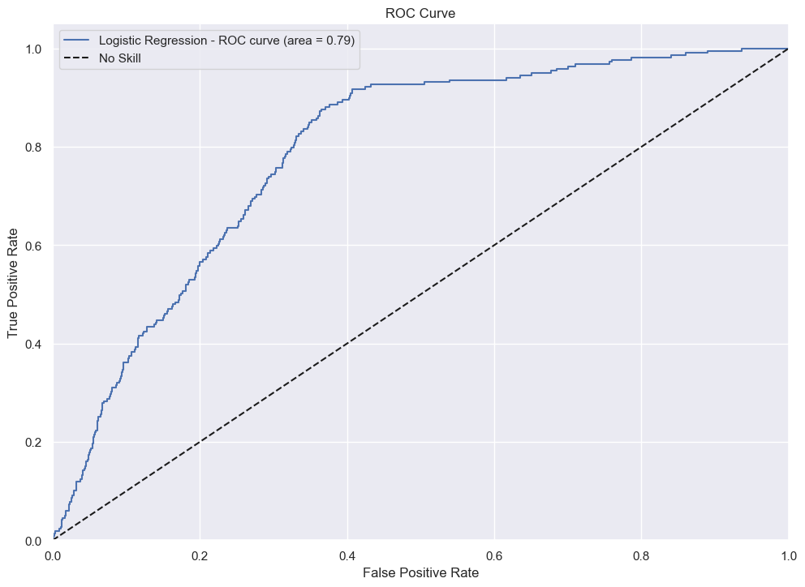
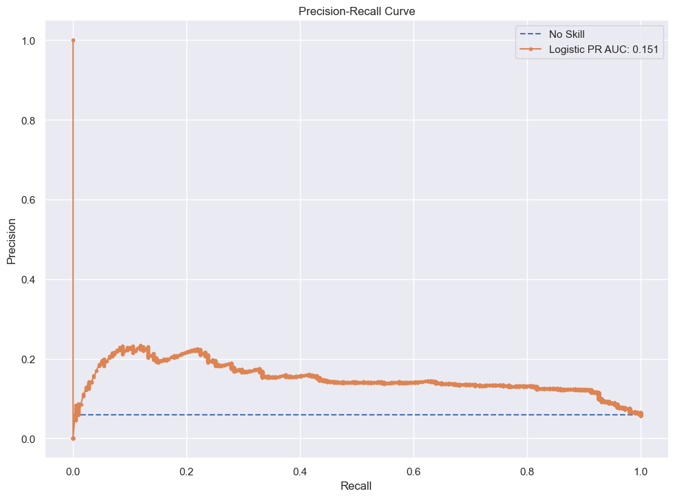
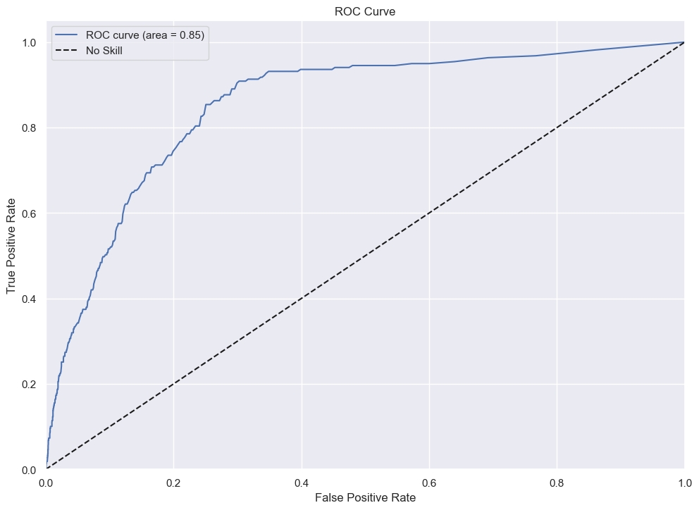
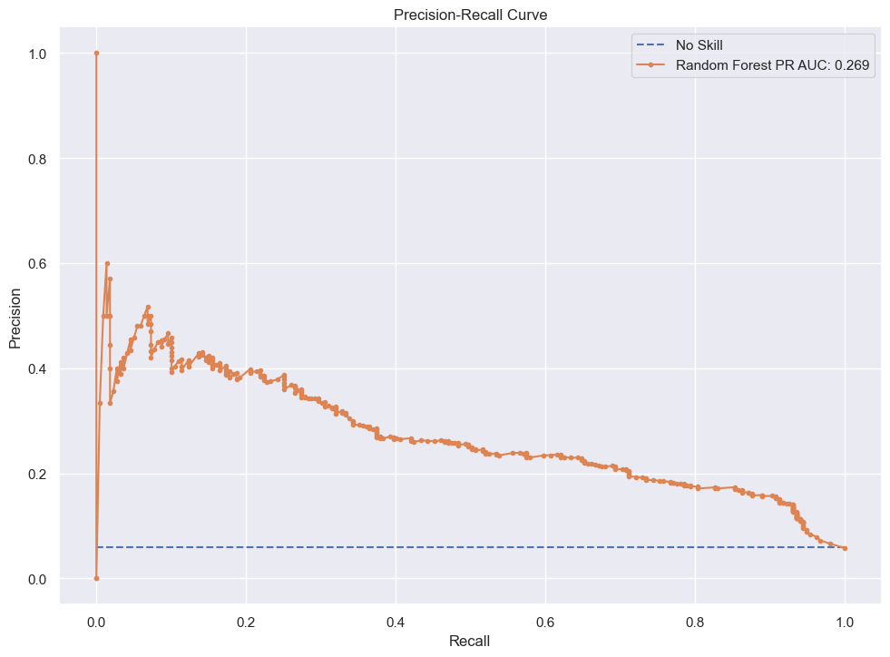
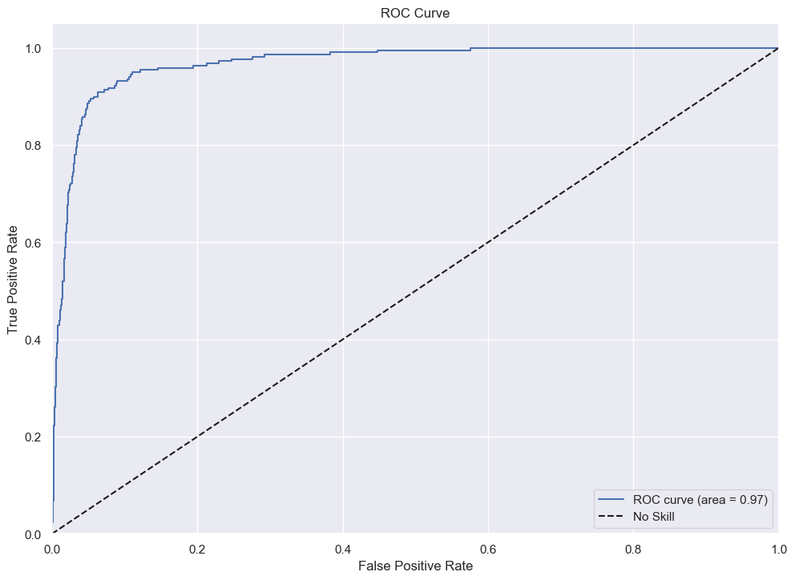
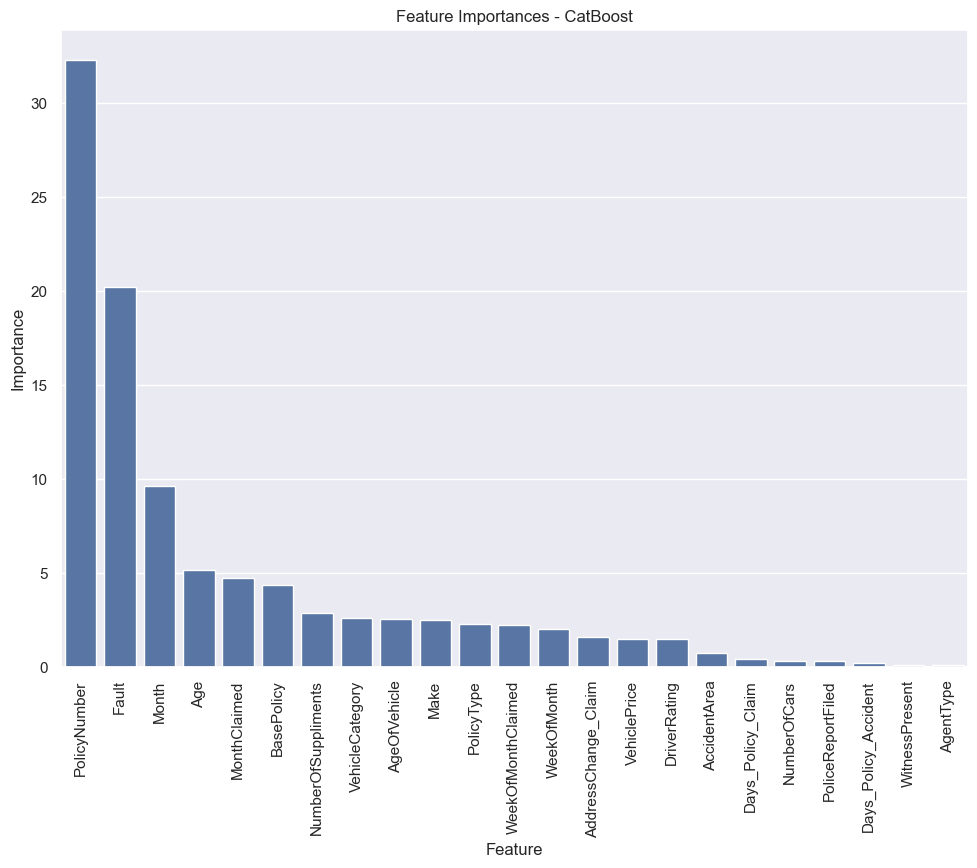
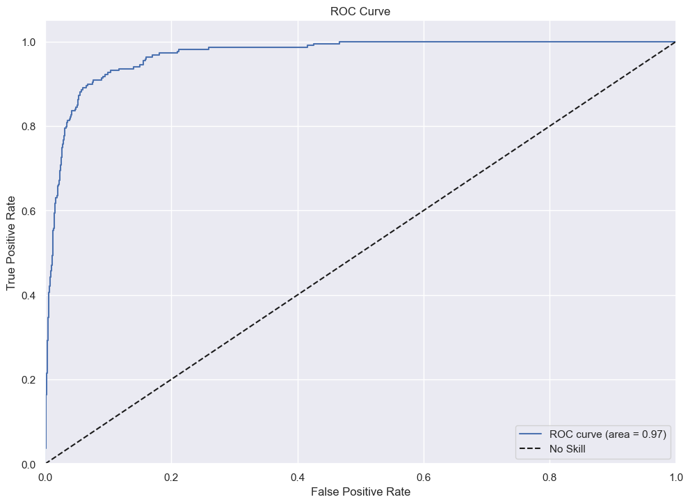
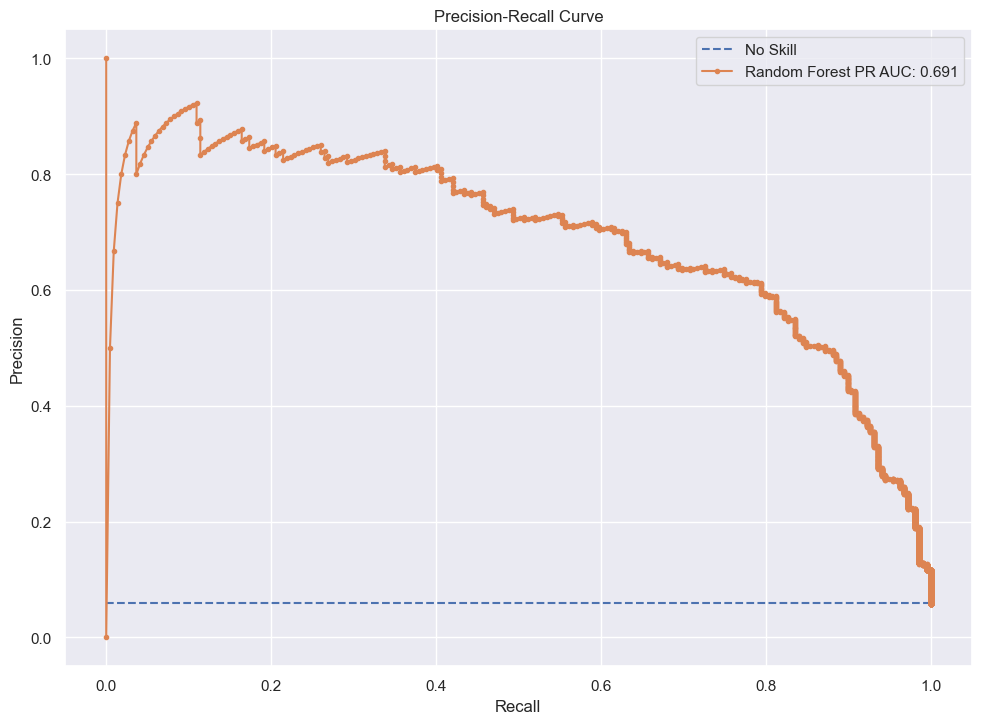

# Fraud Detection of Auto Insurance Claims

## Introduction 
This analysis explores trends in car insurance claim fraud. A machine learning model was created in order to predict new claims as being fraudulent or not. The dataset consists of 15420 claims from the Jan. 1994 to Dec. 1996, with various features about the claim, including date and location of incidence, driver information, car information, policy information etc. There is also a column `FraudFound_P` which indicates whether or not the claim was fraudulent. 

This model would enable insurance companies to target those claims that are most likely to be fraudulent. By eliminating claims unlikely to be fraudulent, human insurance claims specialists only have to examine those claims that have a high probability of fraud, thus making the determination of fraud in insurance claims a more time- and cost-effective process.

## Exploratory Data Analysis

To begin, exploratory data analysis was performed to identify relationships in the data and to ascertain correlations between features and the incidence of fraud. Three relationships in particular demonstrated a clear relationship:

## Data Cleansing

Next, data cleansing was performed to prepare the data for modeling. In order to run the logistic regression and random forest models, categorical data needed to be converted to numerical data. This was achieved using the scikit-learn preprocessing modules OneHotEncoder and OrdinalEncoder. 

## Modeling

### Logistic Regression

The first type of model performed was Logistic Regression. The best performing ROC and PR curves for this model were as follows:

The ROC AUC of 0.79 indicates decent performance of the model, but there is still room for improvement. The PR AUC of 0.151 indicates poor recall.

The feature importance bar chart shown above indicates that `Fault_ThirdParty` and `Fault_PolicyHolder` were the two features that were the largest predictors of fraud in the model.

### Random Forest

The Random Forest model was performed next. The results were as follows:

The ROC AUC of 0.85 indicates strong performance of the model, but there is still room for improvement. The PR AUC of 0.269 shows an improvement in recall over Logistic Regression. Overall, Random Forest performed better than Logistic Regression in this analysis.

In contrast to Logistic Regression, `PolicyNumber` was seen to be the most important feature when using the Random Forest model.

### CatBoost

CatBoost is a framework that can solve for categorical features. The results for the best performing model were as follows: 

These results showed significant improvement from the first two models, both in the ROC Curve and the PR Curve.

Like Random Forest, `PolicyNumber` was seen to be the most important feature when running the model using CatBoost. 

### XG Boost Classifier

XGBoost showed results similar to CatBoost:

